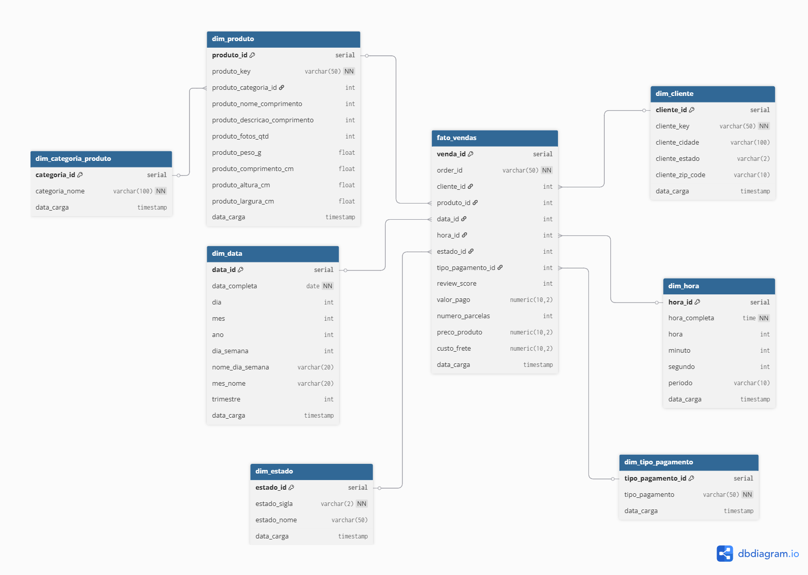

# Projeto I - ETL em Ambiente Containerizado

Este projeto implementa um processo ETL (Extract, Transform, Load) em ambiente containerizado utilizando Docker, Python, MongoDB e PostgreSQL. O objetivo é extrair dados de arquivos CSV e do MongoDB, transformá-los seguindo um modelo dimensional e carregá-los em um data warehouse no PostgreSQL.

## Estrutura do Projeto

```
projeto-i/
├── docker-compose.yml       # Configuração dos serviços Docker
├── .env                     # Variáveis de ambiente
├── images/                  # Imagens para documentação
│   └── modelo_dimensional.png  # Diagrama do modelo dimensional
├── input/                   # Arquivos CSV de entrada
│   ├── olist_customers_dataset.csv
│   ├── olist_order_items_dataset.csv
│   ├── olist_order_payments_dataset.csv
│   ├── olist_orders_dataset.csv
│   └── olist_products_dataset.csv
├── mongodb-init/            # Script de inicialização do MongoDB
│   └── init.js              # Script para inicialização da coleção no MongoDB
└── python_etl/              # Código Python para o ETL
    ├── etl.py               # Script principal de ETL
    ├── requirements.txt     # Dependências Python
    ├── input/               # Link simbólico ou cópia dos dados de entrada
    └── docker/              # Arquivos relacionados ao Docker
        └── Dockerfile       # Configuração da imagem Docker para Python
```

## Modelo Dimensional

O data warehouse implementado segue um modelo dimensional com as seguintes tabelas:




### Tabelas de Dimensão
- **dim_cliente**: Armazena informações sobre os clientes
- **dim_produto**: Armazena informações sobre os produtos
- **dim_categoria_produto**: Armazena as categorias dos produtos
- **dim_estado**: Armazena informações sobre os estados brasileiros
- **dim_data**: Armazena informações de datas para análise temporal
- **dim_hora**: Armazena informações de horas para análise temporal
- **dim_tipo_pagamento**: Armazena os tipos de pagamento utilizados

### Tabela Fato
- **fato_vendas**: Armazena as métricas de vendas, como valor pago, número de parcelas, preço do produto, custo do frete e score de avaliação, relacionando-as com as dimensões.

## Fontes de Dados

### Arquivos CSV
- olist_customers_dataset.csv: Dados dos clientes
- olist_order_items_dataset.csv: Dados dos itens dos pedidos
- olist_order_payments_dataset.csv: Dados de pagamentos dos pedidos
- olist_orders_dataset.csv: Dados dos pedidos
- olist_products_dataset.csv: Dados dos produtos

### MongoDB
- Banco de dados: ecommerce
- Coleção: order_reviews
- Contém avaliações de clientes para 10.000 das 100.000 ordens de compra existentes no dataset

### Considerações sobre os Arquivos CSV

Os arquivos CSV utilizados neste projeto são parte do dataset Brazilian E-Commerce Public Dataset by Olist disponível no Kaggle. Ao trabalhar com estes arquivos, considere:

1. **Tamanho dos arquivos**: Alguns arquivos CSV podem ser grandes. Por padrão, o `.gitignore` está configurado para permitir o commit desses arquivos, mas você pode optar por:
   - Excluí-los do repositório (descomentando a linha `input/*.csv` no `.gitignore`)
   - Usar [Git LFS](https://git-lfs.github.com/) para arquivos grandes
   - Disponibilizar os arquivos em um serviço de armazenamento externo (como Google Drive ou AWS S3)

2. **Download dos arquivos do Kaggle**: Para obter os arquivos CSV do dataset Brazilian E-Commerce Public Dataset by Olist, siga estas etapas:

   a) **Configure a API do Kaggle**:
   - Crie uma conta no [Kaggle](https://www.kaggle.com/) se ainda não tiver uma
   - Acesse sua conta > Settings > API > Create New API Token
   - Isso baixará um arquivo `kaggle.json` com suas credenciais
   - Crie o diretório `.kaggle` em sua pasta de usuário e coloque o arquivo `kaggle.json` dentro dele:
   
   ```bash
   # No Linux/Mac
   mkdir -p ~/.kaggle
   cp kaggle.json ~/.kaggle/
   chmod 600 ~/.kaggle/kaggle.json  # Ajusta permissões por segurança
   
   # No Windows (PowerShell)
   mkdir -p ~\.kaggle
   copy kaggle.json ~\.kaggle\
   ```

   b) **Instale a CLI do Kaggle**:
   ```bash
   pip install kaggle
   ```

   c) **Baixe o dataset**:
   ```bash
   # Navegue até o diretório do projeto
   cd caminho/para/projeto-i
   
   # Baixe o dataset
   kaggle datasets download -d olist/brazilian-ecommerce
   
   # Extraia os arquivos para o diretório input
   mkdir -p input
   unzip brazilian-ecommerce.zip -d input/
   
   # Remova o arquivo zip (opcional)
   rm brazilian-ecommerce.zip
   ```

   d) **Verifique os arquivos**:
   ```bash
   # Liste os arquivos para confirmar que foram extraídos corretamente
   ls input/
   ```
   
   e) **Link para o dataset**:
   - O dataset está disponível em: [Brazilian E-Commerce Public Dataset by Olist](https://www.kaggle.com/datasets/olist/brazilian-ecommerce)

3. **Versionamento dos dados**: Considere adicionar um arquivo de metadados que descreva a versão e a origem dos dados utilizados.

## Tecnologias Utilizadas

- **Docker e Docker Compose**: Para criação e gerenciamento dos containers
- **Python**: Linguagem de programação para o desenvolvimento do ETL
- **PostgreSQL**: Banco de dados relacional para armazenamento do data warehouse
- **MongoDB**: Banco de dados NoSQL para armazenamento das avaliações dos pedidos
- **pandas**: Biblioteca Python para manipulação de dados
- **psycopg2**: Biblioteca Python para conexão com o PostgreSQL
- **pymongo**: Biblioteca Python para conexão com o MongoDB

## Como Executar

1. Clone o repositório:
```bash
git clone <url-do-repositorio>
cd projeto-i
```

2. Certifique-se de que o Docker e o Docker Compose estão instalados em sua máquina.

3. Execute o projeto:
```bash
docker compose up -d
```

4. Verifique os logs para acompanhar o processo de ETL:
```bash
docker logs python_etl
```

5. Acesse o PostgreSQL para verificar os dados carregados:
```bash
docker exec -it postgres_dw psql -U postgres -d pb_dw
```

## Detalhes da Implementação

### Processo ETL

1. **Extração**:
   - Leitura dos arquivos CSV do diretório input
   - Extração de dados de avaliações do MongoDB

2. **Transformação**:
   - Limpeza e normalização dos dados
   - Conversão de tipos de dados (especialmente datas e horas)
   - Mapeamento de chaves estrangeiras entre as tabelas
   - Agregação de dados para cálculo de métricas

3. **Carga**:
   - Criação das tabelas dimensionais e fato no PostgreSQL
   - Carga das dimensões (cliente, produto, categoria, estado, data, hora, tipo de pagamento)
   - Carga da tabela fato com as métricas de vendas e relacionamentos com as dimensões

### Melhorias Implementadas

- **Tratamento de erros robusto**: Adicionado tratamento específico para erros de conexão, autenticação e manipulação de dados
- **Verificação de arquivos**: O script verifica a existência dos arquivos CSV antes de iniciar o processo ETL
- **Logs detalhados**: Logs informativos em cada etapa do processo para facilitar a depuração
- **Transações SQL**: Uso de transações para garantir a integridade dos dados
- **Otimização do Dockerfile**: Estrutura em camadas para aproveitar o cache e reduzir o tempo de build
- **Healthchecks**: Verificações de saúde nos serviços para garantir que estão prontos antes de prosseguir

## Possíveis Melhorias Futuras

- Implementação de testes automatizados
- Paralelização do processamento para melhorar o desempenho
- Monitoramento do processo ETL com ferramentas como Airflow ou Prefect
- Implementação de uma interface web para visualização dos dados carregados
- Adição de mais métricas e dimensões para análises mais complexas

## Conclusão

Este projeto demonstra a implementação de um processo ETL completo em ambiente containerizado, utilizando tecnologias modernas e seguindo boas práticas de engenharia de dados. A solução é escalável, manutenível e pode ser facilmente estendida para incluir novas fontes de dados ou métricas adicionais.

## Responsável pelo projeto

 | [<br><sub>Nathalia Reis</sub>](https://github.com/NathaliaOSReis)
| :---: | 
